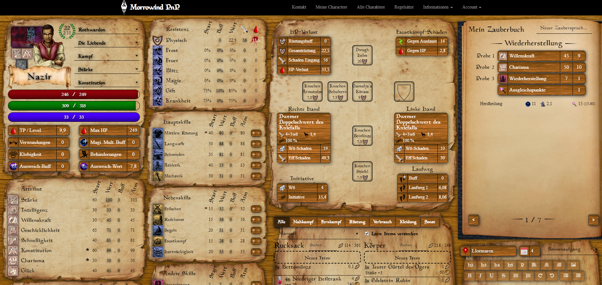

Morrowind Pen & Paper Online Character Sheet
============================================

This is an online character sheet ("charsheet") for a fan-made Pen & Paper ("PnP") role-playing game ("RPG") based on
The Elder Scrolls III: Morrowind by Bethesda Softworks LLC.

Development started in early 2015.

On the server side, it's based on Ruby on Rails (an awesome piece of software running on an awesome language). 
The web frontend uses AngularJS (yes, the old one) - Angular 2 wasn't around yet and I haven't ported it over.

The charsheet service is hosted on https://morrowind.bauske.org.

Current features
----------------

  - View (all players) and manage (GMs only) game resources, including:
    - Races
    - Attributes
    - Skills
    - Resistances
    - Birthsigns
    - Items
    - Magic Spells
  - Create Characters and play them
  - Lots of convenience features to make the PnP game less about managing character properties and more about actual roleplay :)
  - Exporting a character as PDF, ready to print out for offline sessions

~~Issues~~ Problem solving opportunities
----------------------------------------

  - Interface in german only
  - Some game constants hardcoded instead of encapsulated in a rule set
  - Performance could be improved (both server-side and frontend) by upgrading dependencies
  - Some features from the PnP game still missing
    - Sun / Moon - flavoured races
    - Active abilities (partially implemented)

Screenshot
----------

